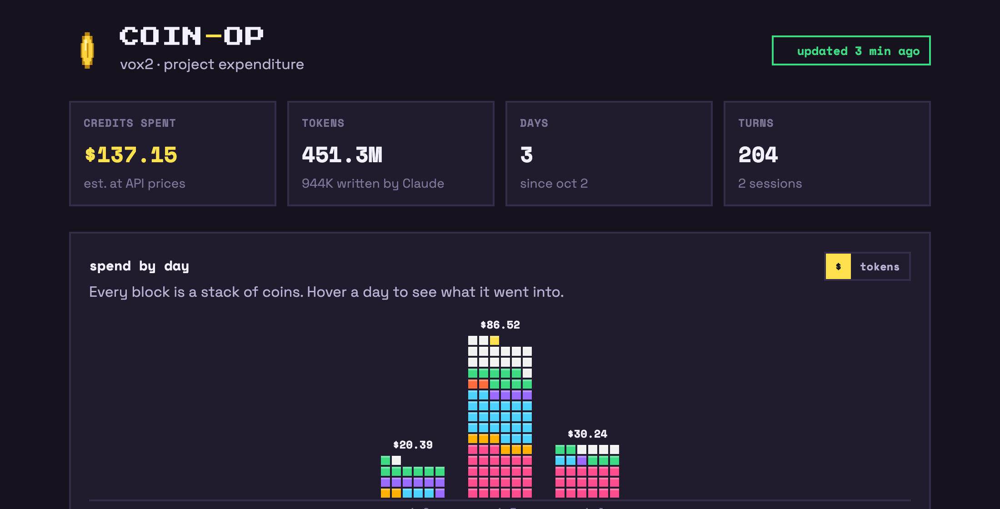
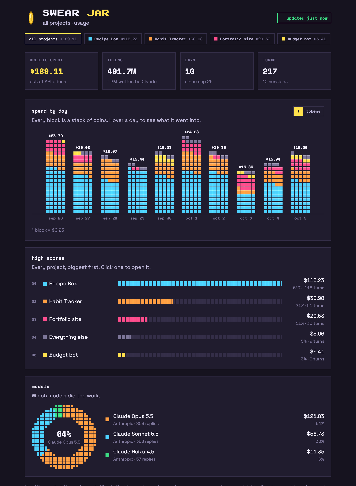
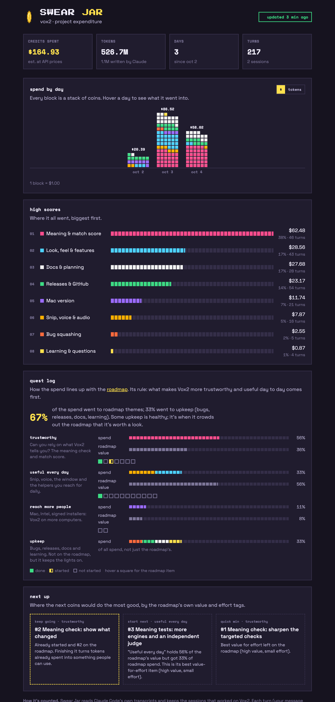

<h1 align="center">🫙 Swear Jar</h1>

<p align="center">A tiny pixel dashboard of where your Claude tokens go.<br>
Day by day, by focus area, and against your product's own roadmap. Track anything you build with Claude Code.</p>

<p align="center"><a href="#make-your-own"><b>Make your own</b></a> · <a href="https://github.com/chrisqtruong/swear-jar/releases/latest/download/swear-jar.zip">Download</a></p>

<p align="center"></p>

## Why

I build [Vox2](https://github.com/chrisqtruong/vox2), a small desktop translator, mostly by working with Claude. A product has a lot of sides: the UI, bug fixes, the Mac port, releases, and lately the meaning check and match score, which was eating a lot of tokens. I wanted to see that: which bucket the work is going into each day, what it would cost, and whether it lines up with what the roadmap says matters most.

It's a small personal project. The sorting is a good guess, not an audit. But it's already useful: it showed that the meaning check took 48% of roadmap spend while holding 32% of the roadmap's value, and that the everyday features were the ones falling behind.

## One dashboard for everything

<p align="center"></p>

Track one project, or all of them. With all of them, the dashboard opens on an overview: total spend, spend per day colored by project, every project ranked, and which models did the work. A tab per project (or a click on its row) opens that project's own view below. Work that didn't touch any project (chats, planning, one-offs) goes under *Everything else*, so the total is all your Claude Code usage.

Setup finds your projects for you: your GitHub repos (with the [`gh` command](https://cli.github.com)), the git clones on your computer, and other folders Claude worked in. Each project can have its own buckets and roadmap.

## What it shows

<sub>Screenshots use a made-up sample project, Recipe Box.</sub>

<p align="center"></p>

- **Score row.** Estimated cost, tokens, days and turns.
- **Spend by day.** Each day is a column of pixel blocks (1 block = $1), colored by bucket. Hover a day for the breakdown; switch between dollars and tokens.
- **High scores.** The buckets, biggest first. Mine are Vox2's (meaning & match score, look & features, Mac version...); yours start as general ones (features & UI, bugs, tests, releases, docs, setup, learning) that you can rename and tune.
- **Models.** A pixel donut of which models did the work, by cost or tokens, grouped by maker. Each family keeps its color (Opus orange, Sonnet blue, GPT white, Gemini yellow...), so a change in the mix stands out.
- **Quest log** (if you point it at a roadmap). Buckets roll up into themes, and each theme's share of spend sits next to its share of the roadmap's value, with its items as done / started / not started.
- **Next up** (with a roadmap). What to aim at next: finish what's started, then the best value-for-effort item in the theme that's furthest behind, then the best quick win.
- **Recent turns** (on your own computer only). Your last few requests and what each cost.

## Make your own

You need [Claude Code](https://claude.com/claude-code) (Swear Jar reads the history it keeps on your computer) and Python 3.9 or newer. Nothing to install.

1. **Download** [swear-jar.zip](https://github.com/chrisqtruong/swear-jar/releases/latest/download/swear-jar.zip) and unzip it somewhere you'll keep it (or `git clone https://github.com/chrisqtruong/swear-jar.git`).
2. **Run setup** from that folder:

   ```
   python3 swearjar.py setup
   ```

   (On Windows, `python` instead of `python3`.) It lists the projects Claude Code has worked on, with what each cost, and asks:

   - **One project or all of them.** "All" lists the projects it found (leave any out by number). "One" asks which project: pick a number, or type its folder name.
   - **A roadmap** (optional). A link to your README or ROADMAP.md with a list under a `Roadmap` heading. It turns on the quest log and next-up picks.
   - **A GitHub repo to publish to** (optional). Leave it blank to keep everything on your computer.
   - **Start at login?** Yes keeps the dashboard current without you thinking about it.

3. **Open it.** [localhost:8642](http://localhost:8642) on your computer, and, if you chose a repo, `https://<you>.github.io/<repo>/`.

### Publishing to the web

Give setup a repo as `you/name`. Swear Jar puts the page and its numbers on a branch of that repo called `swear-jar` and serves it with GitHub Pages; nothing else in the repo is touched, so an existing repo is fine. It signs in with your normal git login. If you have GitHub's [`gh` command](https://cli.github.com) signed in (`gh auth login`), setup can also create the repo and turns on Pages for you; without it, turn Pages on yourself (repo → Settings → Pages → branch `swear-jar`).

Use the same repo on every computer you work on (run setup on each). Each one adds its own file and the dashboard adds them up, so nothing is counted twice or overwritten.

### Tuning it

Your settings are in `~/.swear-jar/config.json` (on Windows, `C:\Users\<you>\.swear-jar\config.json`). Edit it and the dashboard picks it up within seconds:

- **`buckets`**: name, color, and the `words` (in your messages) and `files` (Claude touched) that put a turn in that bucket. These are [regular expressions](https://regexone.com/): `|` means "or".
- **`themes`**: groups of buckets. Mark the ones the roadmap is about with `"roadmap": true`; an `items` pattern sends matching roadmap items to that theme.
- **`exclude`**: other projects' folder names, so work that touches them doesn't count.
- **`projects`** (all-projects mode): a list where each project has a `product` name, the folder names that `match` it, an optional `color`, and optionally its own `buckets`, `themes` and `roadmap`.
- **`roadmap_rule`**: one line on what your roadmap prioritizes, shown above the quest log.

[`examples/vox2.json`](examples/vox2.json) is my full setup for Vox2, as an example of custom buckets and themes.

| | |
|---|---|
| Live page, without starting at login | `python3 swearjar.py` |
| Change your answers | `python3 swearjar.py setup` |
| Stop starting at login | `python3 swearjar.py --uninstall` |
| Count transcripts copied from another computer | `python3 swearjar.py --projects <folder>` |
| Log (macOS) | `~/.swear-jar/log.txt` |

## How it works

```
~/.claude/projects/*.jsonl      Claude Code's own transcripts, on each computer
          │
     swearjar.py                keeps your project's sessions, sorts each turn into a bucket,
          │                     prices it at API rates, reads your roadmap
          ├──▶ localhost:8642   live page on that computer, updates every few seconds
          └──▶ swear-jar branch every 5 minutes: the page + that computer's totals (no prompts)
                    │
          GitHub Pages          your dashboard on the web, checks for new numbers every 2 minutes
```

- **Which turns count.** A turn is your message plus everything Claude did for it. It counts when Claude worked in your project's folder and not in another project's.
- **Buckets.** Picked from the words in your message and the files Claude touched. Short replies like "yes do it" go by the files; background-task notes and context summaries count toward the turn before.
- **Cost.** Tokens priced at Claude API list prices (input, output, cache writes and cache reads). On a Claude plan you pay a flat fee, so read it as a measure of work, not a bill. Most tokens are Claude re-reading the conversation (cache reads), which are cheap, so tokens and cost don't move together.

## Privacy

Everything is read on your own computer. What gets published is only totals per session, day and bucket, plus your parsed roadmap: never your prompts, file contents or anything Claude wrote. The "recent turns" list, which shows your prompts, appears only on the local page.

## Limits

- The buckets are keyword rules: good enough to see the shape, not exact. A turn that fixes a bug *and* merges counts once, for whichever it was mostly about.
- It only knows what Claude Code saved on the computers that run it.
- A turn that works in two projects counts for the one with more files touched.
- It reads Claude Code's history. The model chart already names and groups other makers' models (GPT, Gemini, Llama...), but reading other tools' history (Codex CLI, Gemini CLI, Cursor) isn't built yet. Models without a known price are priced like Claude Opus 5.5 and marked as a rough guess.
- Start-at-login is built in for macOS and Windows; on Linux, run it from your own startup.

## License

[MIT](LICENSE)
